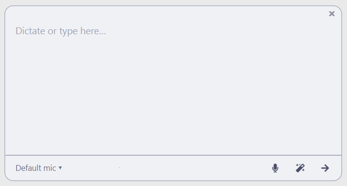

# 🦆 Quack Yapper 🎤

A lightweight desktop overlay for system-wide voice dictation with AI-enhanced text insertion.



Press a hotkey anywhere on your desktop — dictate — optionally enhance with AI — insert at cursor. Works in any application.

## Features

- **Local transcription** — runs entirely on-device via [faster-whisper](https://github.com/SYSTRAN/faster-whisper), no cloud required; the Whisper model is downloaded once on first launch and cached in `~/.config/quack-yapper/models/` (fully offline capable)
- **AI Enhance** — clean up and structure your text with any LLM (Ollama, OpenAI-compatible, or AWS Bedrock)
- **Screenshot context** — optionally attach a screenshot so the AI can match the tone and context (e.g. replying in a Teams chat)
- **Insert at cursor** — pastes the result exactly where focus was before the overlay opened

## Workflow

1. Press `Ctrl+Shift+Z` (or your configured hotkey) from any application — the overlay opens and recording starts immediately.
2. Speak freely.
3. Press the stop button (or the hotkey again) to stop — the transcript appears in the text box.
4. Optionally edit the text or hit **AI Enhance** to clean it up. A screenshot is silently captured on open and can be included as context for the AI.
5. Press **Insert** to paste the text at your original cursor position.

## Keyboard & UI reference

| Control | Action |
| --- | --- |
| `Ctrl+Shift+Z` (default) | Toggle recording / summon overlay |
| 🎤 button | Start / stop recording |
| ✨ button | Open AI Enhance dialog |
| ➜ button | Insert text at original cursor position |
| Device label `▾` | Open microphone picker |
| `×` (top-right) | Close and discard |
| Tray left-click | Show / hide overlay |
| Tray right-click → Exit | Quit |

## Installation

**Requirements:** Python ≥ 3.11, [uv](https://docs.astral.sh/uv/)

```bash
git clone https://github.com/Quack-Norris/quack-yapper
cd quack-yapper
uv sync
uv run quack-yapper
```

On first run, a default config is written to `~/.config/quack-yapper/config.toml` and the configured Whisper model is downloaded in the background to `~/.config/quack-yapper/models/` — open it to adjust the hotkey, theme, LLM provider, Whisper model, and more. The AI Enhance system prompt lives separately in `~/.config/quack-yapper/enhance-prompt.md` and can be edited freely.

## Related

- [Quack Norris](https://github.com/penguinmenac3/quack-norris) — AI coding assistant; pairs well with Quack Yapper for voice-heavy development workflows.

## License

This codebase is licensed under MIT license.
